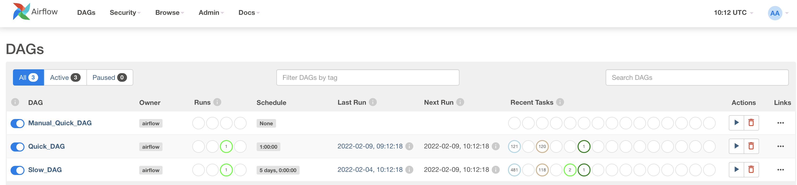

## How to run

```
docker-compose build
docker-compose up
```


## Setup
Have 3 DAGs: 
1. ~240 Tasks, executes every hour, runs for about 45-50 minutes total
2. ~600 Tasks, executes every 5 days, runs for days
3. ~10 Tasks, executes on trigger, runs for 10-50 minutes

DAGs run on the `default_pool` with `max_active_tasks` set to 2.  

My AirFlow config file has the following:
```
parallelism = 32
default_pool_task_slot_count = 6
executor = LocalExecutor
default_task_weight_rule = absolute
```
`parallelism` was set initially like that. 
`default_pool_task_slot_count` was set to 6, because it seemed rational that if all of my 3 dags are executing at the same time, the maximum amount of tasks that can be executed is 3*2=6.

## The problem:
Almost every time any one of the DAGs is executed, no tasks from other DAGs will start until all the tasks from the first one finish. That is, if slow DAG_2 with 600 tasks starts, DAG_1 will have to wait for days to start even a single Task.



The Logs for the Scheduler look like this:
```
scheduler_1  | 
scheduler_1  | [2022-02-09 10:02:27,116] {scheduler_job.py:288} INFO - 4 tasks up for execution:
scheduler_1  |  <TaskInstance: Slow_DAG.files_processing.group_7.command_0 scheduled__2022-02-04T09:57:13.142966+00:00 [scheduled]>
scheduler_1  |  <TaskInstance: Slow_DAG.files_processing.group_119.command_0 scheduled__2022-02-04T09:57:13.142966+00:00 [scheduled]>
scheduler_1  |  <TaskInstance: Slow_DAG.files_processing.group_118.command_0 scheduled__2022-02-04T09:57:13.142966+00:00 [scheduled]>
scheduler_1  |  <TaskInstance: Slow_DAG.files_processing.group_117.command_0 scheduled__2022-02-04T09:57:13.142966+00:00 [scheduled]>
scheduler_1  | [2022-02-09 10:02:27,119] {scheduler_job.py:322} INFO - Figuring out tasks to run in Pool(name=default_pool) with 4 open slots and 4 task instances ready to be queued
scheduler_1  | [2022-02-09 10:02:27,119] {scheduler_job.py:349} INFO - DAG Slow_DAG has 2/2 running and queued tasks
scheduler_1  | [2022-02-09 10:02:27,119] {scheduler_job.py:357} INFO - Not executing <TaskInstance: Slow_DAG.files_processing.group_7.command_0 scheduled__2022-02-04T09:57:13.142966+00:00 [scheduled]> since the number of tasks running or queued from DAG Slow_DAG is >= to the DAG's max_active_tasks limit of 2
scheduler_1  | [2022-02-09 10:02:27,119] {scheduler_job.py:349} INFO - DAG Slow_DAG has 2/2 running and queued tasks
scheduler_1  | [2022-02-09 10:02:27,119] {scheduler_job.py:357} INFO - Not executing <TaskInstance: Slow_DAG.files_processing.group_119.command_0 scheduled__2022-02-04T09:57:13.142966+00:00 [scheduled]> since the number of tasks running or queued from DAG Slow_DAG is >= to the DAG's max_active_tasks limit of 2
scheduler_1  | [2022-02-09 10:02:27,119] {scheduler_job.py:349} INFO - DAG Slow_DAG has 2/2 running and queued tasks
scheduler_1  | [2022-02-09 10:02:27,120] {scheduler_job.py:357} INFO - Not executing <TaskInstance: Slow_DAG.files_processing.group_118.command_0 scheduled__2022-02-04T09:57:13.142966+00:00 [scheduled]> since the number of tasks running or queued from DAG Slow_DAG is >= to the DAG's max_active_tasks limit of 2
scheduler_1  | [2022-02-09 10:02:27,120] {scheduler_job.py:349} INFO - DAG Slow_DAG has 2/2 running and queued tasks
scheduler_1  | [2022-02-09 10:02:27,120] {scheduler_job.py:357} INFO - Not executing <TaskInstance: Slow_DAG.files_processing.group_117.command_0 scheduled__2022-02-04T09:57:13.142966+00:00 [scheduled]> since the number of tasks running or queued from DAG Slow_DAG is >= to the DAG's max_active_tasks limit of 2
scheduler_1  | [2022-02-09 10:02:27,120] {scheduler_job.py:410} INFO - Setting the following tasks to queued state:
scheduler_1  | 

```

I have fixed this by setting 
```
parallelism = 1000
default_pool_task_slot_count = 999
```

## The reason why this occurs and why the solution works

We need to look at this method of the Scheduler:
https://github.com/apache/airflow/blob/2.2.3/airflow/jobs/scheduler_job.py#L229  
In it, the overall logic is the following:
1. Receive `max_tis`(== `parallelism - active running tasks` from the config) in the arguments. In my case that would be 30
2. Calculate how many free slots in **all** all Pools we have. In my case that would be 4.
3. Select the minimum and update the `max_tis` variable: `max_tis = min(4, 30) = 4`
4. Query the DB for tasks that are Scheduled in an unpaused DAGs that are running normally and order them by DAG execution date.
5. Limit the query by `max_tis`.
6. Loop over each returned task and check if we can run it. Run, if possible.

Now, since the tasks are ordered by `execution date`, this will return us tasks for a DAG that started first, which lets say was DAG_2.
It has over 600 tasks. The LIMIT operation will return 4 of them.
Each off these tasks cannot be run since there are already 2 tasks running and the `max_active_tasks` of the DAG is 2.
Thus, we just wait till one of these tasks finish and start another task from the same DAG.
